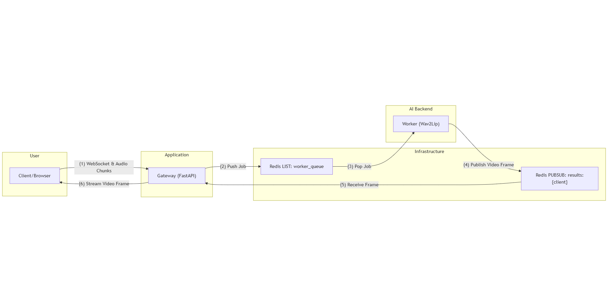

# Real-Time Lip-Sync WebSocket API

This project implements a real-time, streaming lip-syncing system using a Wav2Lip model.

## Table of Contents
* [System Architecture](#system-architecture)
* [Prerequisites](#prerequisites)
* [Installation](#installation)
* [Running the System](#running-the-system)
* [How to Test](#how-to-test)

## System Architecture

1. The Client establishes a WebSocket connection with the Gateway and streams audio chunks.
2. The Gateway pushes these tasks as jobs into a Redis List (worker_queue).
3. The Worker continuously pulls jobs from the queue.
4. After processing the audio with the AI model, the Worker publishes the resulting video frame to a Redis Pub/Sub channel unique to the client.
5. The Gateway, which is subscribed to this channel, receives the frame instantly.
6. Finally, the Gateway streams the video frame back to the Client over the WebSocket, completing the real-time loop.

## Prerequisites
Before you begin, ensure you have the following installed on your system:
* **Docker**: [https://www.docker.com/get-started](https://www.docker.com/get-started)
* **Docker Compose**: (Usually included with Docker Desktop)

## Installation

1.  **Clone the Repository**
    ```bash
    git clone https://github.com/Tanio253/streaming-Wav2Lip
    cd streaming-Wav2Lip
    ```
    
## Running the System
With the model in place, you can start the entire application using a single Docker Compose command:

```bash
docker-compose up --build
```

## How to Test
The gateway provides a built-in HTML client for easy testing.

1.  **Open the Client**: Once the Docker containers are running, navigate to the following URL in your web browser:
    [http://localhost:8000](http://localhost:8000)

2.  **Start a Session**:
    * Click **"Choose File"** and select a clear, front-facing image (PNG or JPEG).
    * Click the **"Start LipSync Session"** button.

3.  **Stream Audio**:
    * **Allow** the microphone permission.
    * Click the **"Start Recording & Streaming"** button.
    * Begin speaking into your microphone.
  
## Non streaming version
Please visit `non-streaming` branch to use the non streaming version, which is of higher quality.

